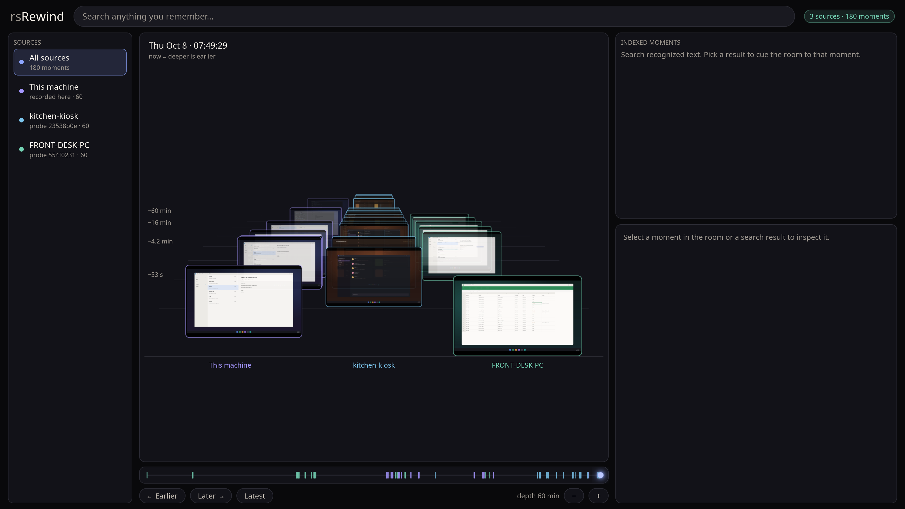

# rsRewind

A local-first screen-history recorder for Windows and KDE Plasma, written in Rust. rsRewind watches your
screens, keeps a visual record of what changed, runs OCR over it, and lets you search your own
history by text, app, window title, or time — entirely on your own machine. There is no cloud
component, no required network service, and no telemetry.

**Current release: v0.0.6** · [install and verify](https://spilloid.github.io/rsRewind/install.html) ·
[release notes and downloads](https://github.com/spilloid/rsRewind/releases/tag/v0.0.6) ·
[website](https://spilloid.github.io/rsRewind/)




## Status: early releases, working end to end

rsRewind records, indexes and searches your screen on Windows 11 and on KDE Plasma under Wayland
(text recognition there uses Tesseract), opens a rewind window over the
history, and can merge history from other machines. Releases are normal, signed GitHub releases,
but rsRewind is **not ready for use on a machine or in a session you are not comfortable
recording.**

- **Known privacy issues are open:** every way a recording can include, keep or misreport what it
  shouldn't is listed, with workarounds, in [issue #12](https://github.com/spilloid/rsRewind/issues/12) (recorder findings
  F2-F5, F9, F21 from the adversarial review; status in `docs/remediation-status.md`, Unit B).
- Data is stored **unencrypted at rest** (see [Privacy and data handling](#privacy-and-data-handling)).
- Importing history from other machines checks integrity, not authenticity, and has not had an
  independent security review.
- The rewind window has been verified on Windows with synthetic history only.

See `ROADMAP.md` for what "done" looks like at each version, `CHANGELOG.md` for what changed, and
`docs/dev-process.md` for how this repository's AI-assisted work is reviewed.

## What it is, concretely

rsRewind runs a background recorder that, roughly once a second per monitor, checks whether the
screen has visually changed since the last capture. When it has, it stores a WebP screenshot,
runs on-device OCR over it, and indexes the recognized text for full-text search. It also tracks
which application and window had focus, so you can later ask things like "what was I looking at
in Teams around 2:30 yesterday" or "find the email that mentioned the Q3 budget."

It is explicitly **not**:

- a cloud service, or anything that talks to one;
- a browser extension, Electron app, or anything running inside a browser runtime;
- a tool that requires Python, Docker, or any other runtime beyond Rust's own compiled output;
- a keylogger or input recorder — it captures screen pixels and window metadata, never keystrokes;
- something that hides itself. The recorder's state is always visible via `rsrewind status`, and
  there is no stealth mode.

## Supported OS

- **Windows 11** — the supported platform. Verified on Windows 11 build 26200.
- **Windows 10** — expected to work where Windows.Graphics.Capture, Windows.Media.Ocr and
  per-monitor-v2 DPI awareness exist, but **unverified**.
- **Linux, KDE Plasma 6 on Wayland** — records (screenshots, window titles, privacy rules, idle and
  lock), since v0.0.4, verified on one machine. Text recognition uses Tesseract once it is installed
  (see the install page); until then moments are browsable but not searchable. Other Linux desktops can run the window, `search`, `import`
  and the rest, but not the recorder.
- **macOS** — planned, not built.

## Build requirements

- **Rust**, stable channel, **1.95 or newer** (pinned via `rust-toolchain.toml`; edition 2024).
  Target `x86_64-pc-windows-msvc`.
- **MSVC Build Tools** (the "Desktop development with C++" workload from Visual Studio Build
  Tools) and the **Windows 11 SDK** — required to link against the Windows APIs the `windows`
  crate wraps.
- No extra runtime is needed to run `rsrewind ui`: it is a native Rust window (Iced + wgpu) and
  needs only a working GPU driver.

If `cargo`/`rustc` are installed via `rustup` but not on your shell's `PATH`, prefix commands
with the toolchain's `bin` directory, e.g. (PowerShell):

```powershell
$env:PATH = "$env:USERPROFILE\.cargo\bin;$env:PATH"
```

## Building and running

```powershell
# Build everything
cargo build --workspace

# Run the test suite
cargo test --workspace

# Format and lint (both must pass with zero warnings before a change ships)
cargo fmt --all -- --check
cargo clippy --workspace --all-targets --all-features -- -D warnings

cargo run -p rsrewind-cli -- status
```

There is one executable, `rsrewind.exe`, with subcommands — see [CLI commands](#cli-commands)
below. Releases ship a signed MSI and a portable ZIP; see `docs/installer.md`.

## CLI commands

| Command | Purpose |
|---|---|
| `rsrewind start` / `stop` | Start the recorder in the background / stop it gracefully. |
| `rsrewind daemon` | Run the recorder in this console (debugging). |
| `rsrewind status [--json]` | Whether it is recording or paused, plus counters. Always available; there is no hidden mode. |
| `rsrewind pause [--minutes N]` / `resume` | Pause capture, optionally for a fixed time. |
| `rsrewind search <text> [--app] [--title] [--since] [--until] [--limit] [--json]` | Full-text search over recognized text, on this machine and every imported one. |
| `rsrewind recent [--limit] [--json]` | The most recent moments across all machines, newest first. |
| `rsrewind gaps [--since] [--until] [--min-seconds] [--json]` | When nothing was recorded, and why (off, crashed, paused, idle or locked, ...). |
| `rsrewind forget <since> --yes` | Permanently delete recent history (screenshots, text, window titles). |
| `rsrewind ui` | Open the rewind window (its own process; `--foreground` stays attached). |
| `rsrewind export` | Seal settled history into segment files for another machine. |
| `rsrewind import <files or folders>` | Merge segment files from other machines (safe to repeat). |
| `rsrewind sources` | List the machines whose history this one holds. |
| `rsrewind doctor [--json]` | Check capture, OCR, disk, database, privacy rules and replication. |
| `rsrewind tray [--start-recorder] [--autostart on\|off]` | Notification-area icon: state at a glance, pause, resume, forget the last 10 min / 1 h, open the window, start/stop (Linux and Windows; macOS next). |
| `rsrewind mcp [--enable\|--disable]` | Let an AI assistant search your history over MCP (stdio; off until enabled; see `docs/mcp.md`). |
| `rsrewind data-dir` | Print the data folder. |

Human-readable output reads naturally; `--json` emits the stable `rsrewind-core` query types
(`SearchHit`, `TimelineEntry`, ...) for scripts and agents.

```
$ rsrewind search konica toner
2026-10-06 21:37:56
Application: WindowsTerminal
Window: zebra crossing schedule
"... [konica] bizhub C360 [toner] low ..."
Image: C:\Users\you\AppData\Local\rsRewind\media\2026\10\07\20261007T013756157Z_m1.webp  (id 4)
```

`search` and `recent` never execute user-supplied SQL — see `ARCHITECTURE.md`'s query
architecture section. Several machines in one view: see **[Many machines](https://spilloid.github.io/rsRewind/probes.html)**
and `docs/design/distributed.md`.

## Where your data lives

Everything rsRewind records stays under:

```
%LOCALAPPDATA%\rsRewind\
  config.toml                 — your settings and privacy rules
  recall.db (+ -wal, -shm)    — SQLite database: events, OCR text, search index
  media\YYYY\MM\DD\*.webp     — screenshots, one file per stored visual change
  logs\                       — application logs (never contain captured screen text; see PRIVACY.md)
  backups\                    — automatic pre-migration database backups
  outbox\                     — sealed segments waiting to be carried to another machine (`export`)
  sources\<id>\              — one full store per imported machine (`import`)
  models\                     — reserved; nothing is downloaded
```

This folder is portable: move it, back it up, or copy it to another machine (set
`RSREWIND_DATA_DIR` to point rsRewind at a non-default location, including another drive). All
database records referencing media use paths relative to this root.

Nothing is ever uploaded anywhere. There is no network client code in the recording path at all.

## Pausing

Run `rsrewind pause` to stop capturing immediately until you resume, or `rsrewind pause
--minutes 30` to pause for a fixed window that resumes itself. `rsrewind status` always shows
whether you are currently paused — there is no way to put the recorder into a hidden or
undetectable state, by design.

## Privacy and data handling

rsRewind captures screen pixels, foreground application/window identity, and OCR text, with
built-in exclusion rules (password managers, private/incognito browser windows) that you can
extend or remove. See **[PRIVACY.md](PRIVACY.md)** for exactly what is captured, how exclusions
work, how deletion works, and — importantly — the current state of encryption at rest (none yet;
your data is protected only by normal Windows user-account file permissions).

## License

MIT. See `LICENSE`.

## Licensing

rsRewind is MIT-licensed. Releases include `THIRD-PARTY-NOTICES.html` for the open-source software it is built
with; the policy and inventory (including Tesseract, which rsRewind runs but does not ship) are in
`docs/licensing.md`.
